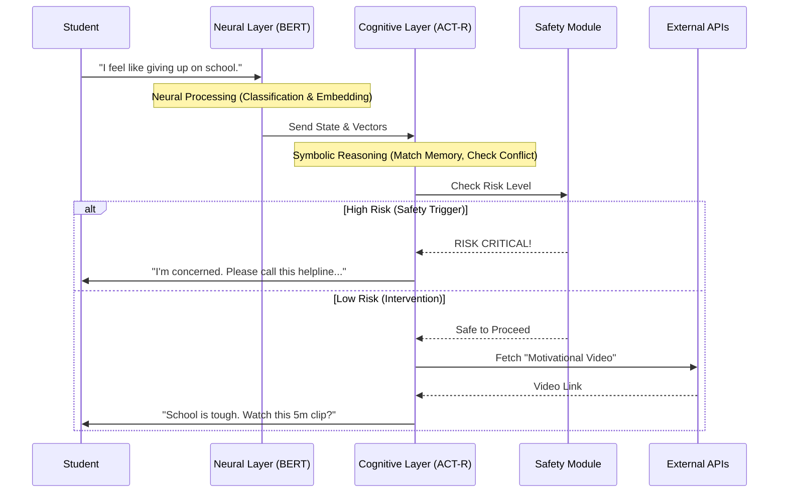

# Hybrid Neuro-Symbolic Mental Health System


A **research-grade AI system** designed for high-stakes emotional distress detection and hyper-personalized student support. This project implements a **Hybrid Neuro-Symbolic Architecture** that bridges deep learning perception with cognitive architectures (**ACT-R and SOAR-R**) to produce **interpretable, temporally consistent, and safety-aware** interventions.

> **Core Philosophy:** In mental health AI, "black box" predictions are insufficient. This system prioritizes **transparency, robustness, and safety** by grounding neural predictions in symbolic cognitive logic.

---

## 📄 Abstract

This system addresses the "black box" problem in mental health AI by fusing **Machine Learning perception** with **Cognitive Control**.

* **ML Perception:** Utilizes a fine-tuned `bert-base-uncased` encoder for supervised emotion classification and `sentence-transformers/all-MiniLM-L6-v2` for generating dense, sentence-level state embeddings.
* **Cognitive Control:** Embeds these neural outputs into an **ACT-R and SOAR-R inspired cognitive layer**. This layer manages **declarative chunks, activation dynamics, goal buffers, and production rules** to simulate human-like reasoning.

The result is a system capable of **calibrated probabilities**, **temporal smoothing** of emotional states, and **rule-gated escalation** for human-in-the-loop safety.

---

## 📖 Project Explanation & Research Basis

### 1. The Core Problem: The "Black Box" in Mental Health
Traditional AI models like ChatGPT or standard classifiers (ResNet/BERT) suffer from the "Black Box" problem. They can predict *that* a user is sad, but they cannot explain *why* in a way that maps to clinical psychology protocols. Furthermore, they lack **state persistence**—if you tell a chatbot you are anxious today, and depressed tomorrow, it often fails to connect these two events into a coherent trajectory.

**Our Solution:** We replace the stateless nature of standard LLMs with a **Neuro-Symbolic Architecture**.
* **Neural (The "Fast" System):** Handles pattern recognition (detecting emotions from text).
* **Symbolic (The "Slow" System):** Handles reasoning (applying safety rules, maintaining long-term memory).

### 2. Methodology & Scientific Justification
This system is built upon three pillars of modern AI research:

#### A. Neural Perception (Transformer Encoders)
We do not rely on a single model. We split perception into **Classification** and **Representation**.
* **Emotion Classification:** Fine-tuned `bert-base-uncased` to detect 28 distinct emotional states (e.g., *Remorse, Admiration, Grief*).
* **Semantic Search:** `all-MiniLM-L6-v2` creates vector embeddings to find "similar past experiences" in memory.
> *Ref: Devlin et al. (2018) [BERT]; Reimers & Gurevych (2019) [SBERT]*

#### B. Cognitive Control (ACT-R & SOAR-R)
Instead of hard-coding `if-else` statements, we implement a **Cognitive Architecture**.
* **ACT-R (Adaptive Control of Thought-Rational):** Simulates "Activation Levels." A memory fades over time unless it is "rehearsed."
* **Production Rules:** Symbolic logic guarantees safety (e.g., `IF suicide_risk > 0.8 THEN trigger_safety_protocol`).
> *Ref: Anderson et al. (2004) [ACT-R Theory]*

---

## 🎯 Research & Engineering Objectives

This system acts as a **Hyper-Personalized Digital Companion** for students, moving beyond simple chatbots to provide actionable, mood-aligned interventions.

| Objective | Description |
| :--- | :--- |
| **1. Neuro-Symbolic Fusion** | Integrate `bert-base-uncased` outputs into **ACT-R/SOAR-R** buffers to maintain a persistent cognitive state rather than stateless predictions. |
| **2. Temporal Consistency** | Use **activation dynamics** and temporal smoothing to ensure that recommendations respect the user's emotional history, not just the immediate input. |
| **3. Context-Aware Interventions** | Dynamically map detected cognitive states to specific media (e.g., *High Anxiety $\rightarrow$ Calming Lo-Fi Music*; *Depression $\rightarrow$ Motivational Biographies*). |
| **4. Safety & Calibration** | Implement **rule-gated escalation** where low-confidence or high-risk neural predictions trigger deterministic safety protocols (e.g., "Refer to Human"). |
| **5. Cross-Platform Integration** | Unified API wrapper to fetch real-time content from **Spotify, YouTube, Netflix, and Books APIs** based on the symbolic "Goal Buffer" states. |

---

## 📊 Technical Analysis & Decision Logic

### 1. Comparative Analysis: Why Neuro-Symbolic?
We benchmark our approach against standard AI methods to highlight the necessity of a hybrid architecture for mental health.

| Feature | 🤖 Pure LLM (e.g., ChatGPT) | 🧩 Pure Symbolic (Old AI) | 🧠 **Our Neuro-Symbolic System** |
| :--- | :--- | :--- | :--- |
| **Interpretability** | ❌ **Black Box:** Reasoning is opaque. | ✅ **Transparent:** Logic is fully traceable. | ✅ **Transparent:** Neural inputs feed into traceable logic. |
| **Consistency** | ❌ **Hallucinations:** Can invent facts. | ✅ **Rigid:** Never deviates from rules. | ✅ **Grounded:** Uses rules for consistency, Neural for nuance. |
| **Safety** | ⚠️ **Probabilistic:** "Usually" safe. | ✅ **Deterministic:** 100% safe within rules. | ✅ **Guaranteed:** Safety rules override neural outputs. |

### 2. The "Digital Wellness Diet" Mapping
How the system translates **neural emotion detection** into **real-world student interventions**.

| Detected Mood | 🎯 Cognitive Goal | 🎵 Spotify/Audio | 📺 YouTube/Netflix | 🧘 Physical Action |
| :--- | :--- | :--- | :--- | :--- |
| **High Anxiety** | Reduce Physiological Arousal | **Playlist:** "Lo-Fi Beats" | **Visual:** "Kaleidoscope visuals" | **Tech:** "Box Breathing" (4-4-4-4) |
| **Academic Burnout** | Restore Cognitive Focus | **Podcast:** "Huberman Lab" | **Stream:** "Study With Me" | **Tech:** "20-20-20 Rule" |
| **Depressive Slump** | Behavioral Activation | **Playlist:** "Upbeat Pop" | **Netflix:** "The Office" | **Tech:** "5-Minute Walk" |

### 3. ACT-R Cognitive Cycle Breakdown
A technical view of how the **Symbolic Layer** processes a single "thought" cycle.

| Component | Function | Example Data State |
| :--- | :--- | :--- |
| **Imaginal Buffer** | Holds the current problem context. | `State: "Exam Tomorrow"` `Emotion: "Panic"` |
| **Retrieval Buffer** | Fetches similar past experiences. | *Retrieving:* "User felt panic before Math midterm last month." |
| **Goal Buffer** | Defines what the system wants to achieve. | `Current Goal: "Stabilize"` $\rightarrow$ `Sub-goal: "Find Music"` |
| **Procedural Memory** | The "If-Then" rules that fire. | **Rule Fired:** `IF goal=stabilize AND emotion=panic THEN suggest_grounding` |

### 4. Decision Flow Sequence
This diagram visualizes the **timeline** of a single user interaction, showing exactly when the Neural and Symbolic systems interact.


### 6. Cognitive State Logic
How the system models the student's emotional transitions from distress to stability.


```mermaid
stateDiagram-v2
    direction TB

    %% --- 1. ENTRY ---
    [*] --> AppraisalPhase : User Input

    %% --- 2. STATE DEFINITIONS ---
    state "🔍 Cognitive Appraisal" as AppraisalPhase {
        [*] --> Classify_Stressor
        Classify_Stressor --> Problem_Input : Exam/Deadline
        Classify_Stressor --> Emotion_Input : Lonely/Sad
    }

    state "🛠️ Problem-Focused (Active)" as Problem_Focused_Coping {
        [*] --> DeepWork_Music : Spotify API
        [*] --> Study_Streams : YouTube API
        DeepWork_Music --> Action_Log
    }

    state "❤️ Emotion-Focused (Passive)" as Emotion_Focused_Coping {
        [*] --> Comfort_Show : Netflix API
        [*] --> Validation_Quotes : Quote API
        Comfort_Show --> Mood_Log
    }

    state "📝 Efficacy Loop" as Re_Evaluation {
        state "Did it help?" as Check
        Check --> Encode_Success : Yes (Store Memory)
        Check --> Strategy_Shift : No (Try Branch B)
    }

    %% --- 3. TRANSITIONS ---
    AppraisalPhase --> Problem_Focused_Coping : If Stressor = Challenge
    AppraisalPhase --> Emotion_Focused_Coping : If Stressor = Threat/Loss

    Problem_Focused_Coping --> Re_Evaluation : Execute
    Emotion_Focused_Coping --> Re_Evaluation : Execute

    Strategy_Shift --> AppraisalPhase : Re-Assess
    Encode_Success --> [*]
